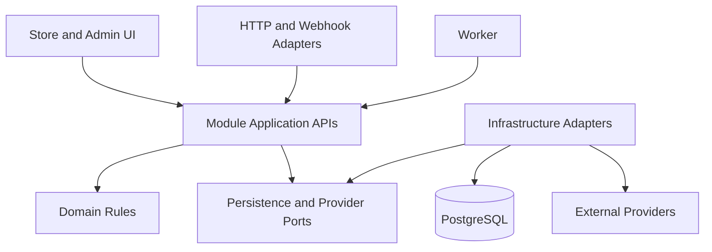
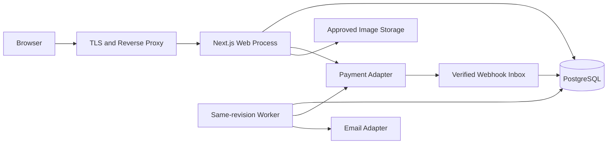

# Architecture Spine — bmadecomm

## Design Paradigm

Modular Monolith بأسلوب layered؛ تطبيق Next.js واحد وعامل خلفي من المستودع نفسه، وقاعدة PostgreSQL واحدة. لا كود تطبيق قائم لتوريثه. ADOPTED تعني اعتماد المستخدم؛ بقية القواعد مشتقة من المصدر. أسماء الجداول والroutes في companion بذرة عقود؛ التفاصيل الموسومة PROPOSED تحتاج تثبيتًا قبل القصص المتأثرة.



الاتجاه يدل على اعتماد برمجي؛ application لا تستورد Next.js أو SDK خارجي، وdomain لا تستورد HTTP أو DB. composition root يربط المنافذ بالمهايئات. UI تتلقى DTO صريحة، ولا تستورد تطبيق الخادم إلى client bundle.

## Invariants & Rules

### AD-1 — حدود التطبيق [ADOPTED]
- **Binds:** all؛ FR-58/59.
- **Prevents:** نسخ قواعد الأعمال بين صفحات المتجر والإدارة والعامل.
- **Rule:** وحدات مجال داخل تطبيق واحد؛ app/HTTP طبقة تكييف فقط. worker يستدعي application APIs نفسها. لا تعديل بيانات وحدة من repository وحدة أخرى؛ تنسيق checkout/fulfillment يجمع عمليات المالكين داخل transaction مشتركة، وليس HTTP داخليًا. infrastructure ينفذ المنافذ، وshared لا يملك كيانات أعمال.

### AD-2 — ملكية البيانات والعقود
- **Binds:** FR-05/13/19/23/30/33/37/41/45/55/58.
- **Prevents:** مالكان لحالة واحدة أو اختلاف DTO بين الإدارة والمتجر.
- **Rule:** identity يملك credentials/sessions/grants؛ customers profile/addresses؛ catalog المنتجات والأنواع/التصنيفات؛ inventory الأرصدة والحجوزات/ledger؛ pricing حساب السعر؛ cart السلة؛ orders snapshots وOrderStatus/history؛ payments attempts/receipts/PaymentStatus؛ refunds budgets/attempts/allocations؛ fulfillment FulfillmentStatus والشحن/فحص المرتجع؛ notifications deliveries؛ audit الأحداث؛ reporting projections قراءة فقط. coupons وحدة فرعية في pricing وsettings وحدة فرعية في content حتى لا تنشأ ملكية ثانية. المالك وحده يكتب. عقود commands/DTO versioned مشتركة؛ joins تقارير قراءة صريحة لا mutation خفية.

### AD-3 — ذرية المخزون والمعاملات
- **Binds:** FR-20/23/28/30–32/35/38/57؛ AC-04/08/09/14.
- **Prevents:** قبول مخزون مرتين وسباق انتهاء الحجز والدفع والشحن.
- **Rule:** PostgreSQL مصدر الحقيقة. على كل mutation مؤثرة قفل Order أولًا إذا وجد، ثم inventory حسب variant ID تصاعديًا، ثم coupon حسب ID؛ إنشاء checkout يقفل سجلات idempotency ثم inventory ثم coupon. جميع المسارات تتبع الترتيب نفسه. الأرصدة والتخصيصات والledger وآثار coupon/order/outbox في transaction واحدة قصيرة، دون اتصال مزود. OnHand≥0 وReserved≥0 وAvailable=OnHand−Reserved؛ عند تعطيل backorders لا Reserved>OnHand. إعادة محاولات deadlock محدودة للعملية المحلية كلها بالمفتاح نفسه.

### AD-4 — سعر ولقطة طلب موحدان
- **Binds:** FR-19/20/33/42/55/57؛ AC-05/10/19.
- **Prevents:** اختلاف حساب المتصفح أو تغير سجل مالي بتعديل المنتج.
- **Rule:** pricing وحده يحسب؛ money لا يستخدم binary float، يحفظ minor units الصحيحة مع currency/scale، والنسب الوسيطة exact decimal. DTO مبالغ نصوص صحيحة. تخزن snapshot البنود والخصم/الضريبة والشحن والعناوين وتوزيعاتها والسياسة/version عند إنشاء الطلب؛ لا يعاد حساب القديم بالبيانات الحية. total=sum allocations طبق السياسة المعتمدة؛ تغيير quote يتطلب مراجعة صريحة. سياسة الضرائب والتقريب والعملات بوابات OQ-01/03 وA-03/04 لا قيم ضمنية.

حالة coupon usage مستقلة: Reserved عند تقديم Order، Consumed عند Paid إلكترونيًا أو Confirmed COD، Released عند إنهاء الطلب غير المقبول لا فشل attempt وحده إن بقي retry صالح. [PROPOSED، PRD §6.1/OQ-03/04] قبول سابق ثم cancel/refund لا يعيد الحد تلقائيًا. reserved+consumed لا يتجاوز cap؛ لكل identity مثبتة، والكوبون المخصص لعميل لا يجيزه email الضيف المرسل وحده. جميع النتائج تستخدم reducer واحدًا وtransaction guard مع order.

إذا وصل Paid موثوق بعد Released واستنفد cap بطلب آخر، يسجل receipt مستقلًا عن نجاح إعادة claim؛ لا rollback للقبض ولا تجاوز cap ولا تعديل snapshot. تسجل مهمة discrepancy وتمنع acceptance/fulfillment الصامت حتى تسوية مخولة. سياسة تسوية الكوبون المتأخر قرار صريح OQ-03/04 قبل قصص late-payment/coupon؛ لا تفترض هذه المعمارية أن refund إجباري أو أن discount يُسحب. اختبار cap=1 مع late Paid جزء AD-17.

### AD-5 — Idempotency عبر الحدود
- **Binds:** FR-23/24/27/37/46/57؛ AC-03/06/07/15/24.
- **Prevents:** order أو charge/refund/event إضافي بسبب retry.
- **Rule:** مفتاح فريد scoped إلى actor أو guest checkout identity + operation، مع canonical payload hash وحالة/result reference في DB. نفسه ونفس المدخل يعيدان المورد؛ hash مختلف يعيد conflict. unique لكل provider event/ref ومعرف أثر ledger/event التجاري. provider request key مشتق ثابت من local attempt ID؛ unknown لا ينشئ محاولة مالية جديدة حتى query يحسمها. retention للمفاتيح لا يقل عن نافذة retry/reconciliation المعتمدة ويثبت قبل القصص؛ charge/refund references لا تعاد استخدامها.

### AD-6 — حدود الدفع الخارجي
- **Binds:** FR-23–29/59/60؛ AC-06–08.
- **Prevents:** إعلان Paid من redirect أو ضياع قبض عند تعطل التطبيق.
- **Rule:** Order Pending والحجز ومحاولة/outbox durable تسبق طلب المزود. raw webhook body يتحقق من signature/replay policy ومن provider/order/amount/currency ثم inbox durable deduplicated؛ التنفيذ وإعلان processed لهما transaction واحدة. return URL للعرض/query فقط. النجاح الموثوق لا يعكسه failed أقدم. worker/query/webhook تستخدم reducer واحدًا؛ Paid متأخر يسجل القبض دائمًا، يعيد تخصيص كامل ذرّيًا فقط إن غير ملغى ومتاح، وإلا مهمة refund/block fulfillment. provider غير محدد، ولا يفترض API نجاحًا أو exactly-once شبكة.

### AD-7 — الحالات وانتقالات الأوامر
- **Binds:** FR-26/31/33–36/58؛ PRD §7؛ AC-16/23.
- **Prevents:** جمع الطلب والدفع والتجهيز في status واحدة أو نجاح stale update.
- **Rule:** OrderStatus=Pending/Confirmed/Cancelled/Completed منفصلة عن PaymentStatus لكل attempt وFulfillmentStatus. transition commands مركزية مع expected_version شرط تحديث؛ القديمة conflict. history/audit/version والأثر في transaction واحدة. Delivered لا يعني قبض COD؛ Completed لا يُمحى باسترداد. électronique لا يشحن دون Paid وتخصيص، وCOD طبق أهلية السياسة. الإلغاء طلب عميل منفصل عن تنفيذ إدارة؛ لا partial shipment P0. expiry/payment/cancel/ship تستخدم guard نفسه؛ الشحن يخصم OnHand وReserved مرة واحدة فقط، Paid timely يحول الحجز إلى allocation دون خصم OnHand.

### AD-8 — سقف الاسترداد والإرجاع
- **Binds:** FR-37/38؛ AC-14/15.
- **Prevents:** استردادات متزامنة تتجاوز المقبوض أو إعادة مخزون بلا استلام.
- **Rule:** قفل Order ثم receipt/refund budget بترتيب ID؛ confirmed+pending refunds≤confirmed receipts لكل العملة. يحجز السقف محليًا قبل المزود؛ unknown يبقيه، definitive failure يحرره، النجاح يقفل أثره مرة واحدة. توزيعات item/shipping/tax ثابتة لا تتجاوز الأصل. COD payout مرجع وتأكيد خارجي لا card data. refund لا يعدل المخزون؛ restock بعد فحص كمية المرتجع مرة واحدة وفق disposition، مع returned quantity≤shipped quantity.

### AD-9 — جلسات وتفويض
- **Binds:** FR-01–07/29/40/45؛ NFR-12؛ AC-02/12/13/17.
- **Prevents:** اعتبار إخفاء الزر تفويضًا أو استمرار دور مسحوب أو guest lookup بالرقم.
- **Rule:** كل request/command يقيم session active/expiry/account state والصلاحية والفعل وownership وfield DTO على الخادم؛ لا grants غير قابلة للإبطال في JWT وحده. بيانات العميل/الموظف لها سياقان منفصلان ولا customer session تمنح admin. sessions opaque، تخزين token hash، Secure/HttpOnly host-only cookies، rotate/revoke؛ identity transition transaction تدعم reset/revocation وحماية آخر Owner المتزامنة. password library موثوقة وتجزئة حديثة؛ الاختيار التفصيلي تحت Deferred. proof tokens single-use hashed scoped purpose/order/user، guest token read-only ولا claim إلا الإثباتين المطلوبين. أطوال/أعمار/MFA تحت OQ-06 وA-09/10، لا تعتمد كقيم إطلاق.

حماية آخر Owner في AD-9 تستخدم قفل guard واحد مشترك لكل grant/revoke/disable يمس active Owners ثم إعادة count داخل transaction؛ عدّان منفصلان دون serialization لا يحققان القاعدة. account/session scope يقيم identity المطلوبة قبل replay operation key أيضًا.

### AD-10 — API والتحقق والأخطاء
- **Binds:** FR-58/59؛ UX forms/states؛ AC-05/11/23.
- **Prevents:** payload/خطأ مختلف لكل شاشة أو قبول قيم مالية/امتيازات من العميل.
- **Rule:** REST JSON تحت /api/v1؛ versioned DTO schemas runtime مشتركة لvalidation من الخادم إلى UI، لا DB entities عامة. unknown writable fields مرفوضة. validation طبقات schema/domain/DB؛ auth قبل كشف تفاصيل المورد. errors بالضبط code,message,details,request_id؛ details حقول آمنة، لا stacktrace. 401 جلسة،403 ممنوع،404 غير موجود/مخفي،409 conflict،422 domain/fields،429 rate،503 dependency. النجاح المعتمد في command transaction؛ unknown خارجي يعيد مورد Pending لا نجاح وهمي. schema endpoint/paging/limits تثبت قبل قصته حسب SOLUTION-DESIGN.

### AD-11 — حالة الواجهة وقيود UX
- **Binds:** FR-09–12/17–19/24/29/47–54؛ NFR-08/09؛ UX-01–12.
- **Prevents:** money optimistic أو سر/PII في client storage أو اختلاف فلاتر الرجوع.
- **Rule:** public catalog SSR؛ client components للتفاعل فقط. query/filter/sort/page في URL؛ forms محلية غير حساسة، cart identity server-backed لا تخزين secrets. server owns totals/status/auth. لا optimistic مالية/مخزون/صلاحيات؛ loading/success/error/empty/unknown/stale/session-expired من UX. جميع أعمال P0 متاحة mobile/keyboard، الإدارة separate navigation، RTL بحسب اللغة المعتمدة، identity المرئية غير محددة ولا defaults للمكتبة تعتمد كهوية. P1 لا controls قبل إطلاقها.

### AD-12 — Cache مع حدود ثقة
- **Binds:** FR-08–16/19/31/41؛ NFR-01/02/12.
- **Prevents:** كشف خاص في shared cache أو قبول price/stock قديم.
- **Rule:** cache مسموح للصور والمحتوى والكتالوج العام المنشور مع invalidation بعد commit. account/admin/checkout/pay/guest proofs no-store/private؛ draft preview لا shared cache. mutation دائمًا يقرأ الحقيقة من DB لا cache. reporting projections تحمل as_of؛ لا cache permissions يتخطى revocation next request. لا Redis/search cluster مطلوب للإطلاق؛ إضافته مشروطة بقياس يثبت الحاجة.

### AD-13 — Jobs وOutbox
- **Binds:** FR-27/28/43/44/60؛ NFR-05/06/10؛ AC-18.
- **Prevents:** فقدان الرسالة بعد commit أو تكرار الأثر بعد crash.
- **Rule:** أحداث notifications/reconciliation/expiry/recovery durable outbox في transaction المصدر؛ worker من نفس revision يستخدم lease/attempt/backoff/dead-letter تحت DB. at-least-once delivery مع idempotent handlers؛ لا in-memory timers أو HTTP after callback كضمان دوام. انتهاء lease يسمح retry دون إعادة أثر. success ack بعد أثر دائم؛ نتيجة مالية مجهولة query أولًا لا resend أعمى. التشغيل يعرض retry مخول مع audit دون force-paid/manual DB؛ timings من A-11/OQ-06.

### AD-14 — الملفات والتكاملات
- **Binds:** FR-15/16/36/43/56/59؛ NFR-09/12.
- **Prevents:** نشر صورة غير مفحوصة أو ربط domain بمزود محدد.
- **Rule:** object storage خارج local ephemeral filesystem؛ metadata بمالك catalog. upload authorized scoped، quarantine/actual decode/type/size validation ثم publish approved image، أسماء غير executable وopaque، لا SVG/HTML دون متطلب مستقل. limits ضمن A-11. credentials server-only، adapters payment/email/storage، شحن يدوي وفق A-02 لا carrier API مفترض. تعطل مزود لا يحذف Order؛ durable failure/retry. providers/regions/SDKs عقود OQ-02/05 لا يختارها هذا التصميم.

### AD-15 — التدقيق والملاحظة والتحليلات
- **Binds:** FR-41/43–46/60؛ NFR-05–07/12/13؛ AC-20/24.
- **Prevents:** مال غير قابل للتتبع أو تسريب بيانات/مضاعفة purchase.
- **Rule:** audit append-only redacted actor/action/resource/time/diff/request_id مع mutation transaction؛ app role لا update/delete audit. logs structured request/attempt/job identifiers دون credentials/proof/rawcards/PII غير لازم. alerts unknown payment/refund، job lag/email failures/inventory discrepancy/checkout failures مستقلة عن request success. reporting من receipts/refunds/fulfillment لا analytics، وتعريف metrics من PRD §10. purchase unique order business event: Paid online/Confirmed COD، consent gate قبل browser telemetry، لا event من refresh.

### AD-16 — الأمن وحدود التشغيل
- **Binds:** FR-07/56/59؛ NFR-12–14؛ AC-20/22.
- **Prevents:** sessions قابلة للسرقة أو نشر بلا recovery.
- **Rule:** TLS، cookie mutation CSRF+Origin validation، parameterized SQL، output encoding/CSP، body limits وrate limits مشتركة DB-backed لكل replicas على login/reset/guest/checkout/webhooks وفق threat context. أسرار منفصلة البيئات، أقل امتياز DB/jobs/storage؛ DB لا تعرض للمتصفح. local/staging/production منفصلة، provider sandbox staging، production لا تستخدم seed credentials؛ migration expand/contract وrelease revision/rollback وأدلة restore قبل الإطلاق. لا analytics production/PII قبل OQ-05.

### AD-17 — اختبارات حدود الوحدات
- **Binds:** AC-01–24؛ NFR-01–14.
- **Prevents:** اختبارات mocks تثبت منطقًا مختلفًا عن معاملات الواقع.
- **Rule:** unit للمال/state reducers، integration على PostgreSQL حقيقي للقيود/locks/rollback/idempotency؛ provider contracts sandbox؛ E2E storefront/admin/guest/customer/roles/error accessibility من UX. اختبارات متزامنة stock=1/refund budget/coupon last use/last Owner، crash بعد provider success وقبل local save، webhook replay/out-of-order/late Paid، expiry-vs-shipping. load/restore/alert/rollback دليل منفصل لا mock. قصة تسمي AC/AD وعقودها قبل التنفيذ؛ لا ادعاء اجتياز الآن.

### AD-18 — بوابات الاعتماد والنطاق
- **Binds:** all؛ FR-47–54؛ PRD §13/14؛ UX Open Items.
- **Prevents:** تحويل الافتراضات إلى شروط منتج معتمدة أو بناء P1 في P0.
- **Rule:** لا تغيير A/OQ ضمن المعمارية. قصص السوق/pricing/orders/auth/infra تحدد قرارات OQ التابعة وتمنع التنفيذ النهائي المتأثر حتى اعتمادها. P1 مجرد extension boundaries دون schema/screens/services إطلاق؛ P2 خارج النطاق. القرارات التقنية غير الموروثة مقترحات تثبت قبل قصصها، لا authorization للإطلاق أو implementation في هذه الجولة.

## Consistency Conventions

| Concern | Convention |
|---|---|
| IDs | UUID داخلي، order_number منفصل unique ليس سرًا؛ API opaque strings، SKU/slug/coupon لها unique constraints مع normalization ثابتة قبل القصة. |
| Time | UTC timestamptz وISO8601 UTC API؛ timezone عرض setting snapshot/report filter، لا date محلي بدل instant. |
| Concurrency | expected_version لكل تعديل مورد mutable مشترك؛ operation idempotency للآثار؛ database unique/check/FK آخر خط دفاع. |
| Paging | page/page_size مع count وsort ثابت secondary ID؛ حدود endpoint تثبت بالعقد قبل القصة، allowlist fields لا SQL params حرة. |
| State | enums من PRD §7 فقط، refund/job states داخلية لا تعيد تعريف حالات الطلب. |

## Stack

هذه بذرة موثقة بتاريخ التحقق، وليست تثبيت حزم أو موافقة على كل patch. تعاد مراجعة security/compatibility وlockfile قبل bootstrap. TypeScript 7.0 المذكور في المصدر لا يعني توافقه المختبر مع starter؛ pin الفعلي من compatibility gate.

| Name | Version |
|---|---|
| Next.js / create-next-app | 16.3.8، official App Router starter |
| Node.js | 24.21.0 LTS، seed مقترح |
| TypeScript | 7.0، إصدار المصدر الحالي؛ pin التوافق مؤجل قبل bootstrap |
| PostgreSQL | 18.6، seed مدعوم مقترح |

## Structural Seed

```text
src/
  app/                 Store/account/admin/API HTTP adapters
  modules/             identity catalog inventory cart pricing checkout orders
                       payments refunds fulfillment customers content
                       notifications reporting audit
  components/          Shared presentation only
  infrastructure/      database integrations jobs observability
  shared/              Small stable contracts/primitives
database/              migrations seeds
tests/                 integration e2e
docs/architecture/     Accepted contracts and decisions
```

داخل الوحدة domain/application/persistence/contracts/ui حين يلزم؛ لا folders فارغة مفروضة. worker entrypoint داخل infrastructure/jobs؛ تستخدم repositories السياق نفسه للمعاملة.



staging/production نسختان مستقلتان من topology، لا خدمات مشتركة تحتوي بيانات أو credentials. اختيار managed hosting/region قبل deployment stories تحت OQ-05/06؛ لا Kubernetes مطلوب.

## Capability → Architecture Map

| Capability / Area | Lives in | Governed by |
|---|---|---|
| FR-01–07 الهوية والملكية | identity/customers | AD-2/9/10/16 |
| FR-08–16 الكتالوج والمحتوى | catalog/content | AD-2/11/12/14 |
| FR-17–22 السلة والتسعير والعنوان | cart/pricing/checkout/customers | AD-3/4/10/11 |
| FR-23–29 الدفع/التتبع | checkout/orders/payments/identity | AD-3–7/9/13 |
| FR-30–32 المخزون | inventory | AD-3/7/13 |
| FR-33–39 الطلب/الشحن/الاسترداد | orders/fulfillment/refunds | AD-4/7/8/15 |
| FR-40–46 العملاء/الإعداد/الرسائل/التدقيق/القياس | customers/content/reporting/notifications/audit | AD-2/9/13/15 |
| FR-47–54 P1 | امتدادات مؤجلة للوحدات المالكة | AD-18 |
| FR-55–60 البيانات/العقود/التشغيل | جميع الوحدات والبنية | AD-2–10/13–18 |
| NFR-01–14 وAC-01–24 | Web/DB/Worker/QA/ops | AD-11–18 مع قواعد المال |

## Deferred

- OQ-01/03: السوق والعملة/scale واللغة والضرائب والفاتورة؛ قبل contracts pricing/address/schema المالية. لا tax=0 fallback.
- OQ-04: مدد الحجز/COD/الإلغاء/الإرجاع؛ guards ثابتة لكن القيم وسياسات eligibility تنتظر اعتماد الأعمال.
- OQ-02/05/06: provider/region/retention/consent/budget/SLO والمزودين؛ قبل integration/deployment. استضافة managed PostgreSQL وweb+worker توصية غير شراء.
- OQ-06/08: role matrix النهائية وMFA/session/proof limits وإجراءات الإنقاذ؛ قبل identity/admin stories النهائية. أسماء permissions ومكتبة auth/ORM/validation/test runner وSDK pins تثبت في foundation story مشتركة، وليست خيارات مستقلة لكل وحدة.
- معدل rate limit المبدئي PROPOSED: login 5 failures/15min per identity+IP، reset/guest resend 3/hour per normalized target+IP، checkout 10/min per guest/customer، upload 20 files/10min per authorized actor مع body-size limits، مع حدود IP أعلى لمنع shared-IP lockout؛ webhook لا يرفض event شرعيًا بحد مستخدم بل body/signature/queue/provider retries. لا تعتمد للإطلاق قبل OQ-06 واختبار abuse؛ DB limiter shared atomic.
- سياسة guest resend technical PROPOSED: order_number+email normalized للتحقق الداخلي، response عام دائمًا، الإرسال فقط لبريد snapshot؛ token exchange إلى cookie read-only ثم إزالة token من URL وReferrer-Policy no-referrer. لا كشف mismatch ولا تحديث mail بالمُدخل.
- QR/MFA recovery/staff provisioning/claim UX وحقول settings/content التفصيلية تحت foundation contracts قبل قصصها؛ لا ابتداع إرسال credentials أو دعوات منتج غير مطلوبة.
- UI library/colors/fonts intentionally unspecified بطلب المستخدم؛ تستكمل لاحقًا دون تغيير UX behavior.
- full DDL/index tuning/provider payloads وtest tooling versions بذرة تنفيذ لاحقة في عقد واحد مشترك؛ لا يجوز حل invariant مشترك بشكل مختلف بين القصص.
