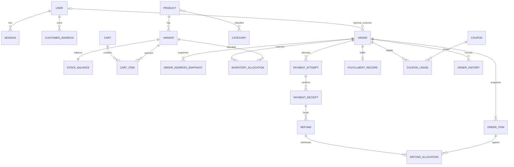

# شرح المعمارية للمطورين وQA

مرجع متطلبات المنتج هو [PRD v2](../../prds/prd-bmadecomm-v2-2026-10-05/prd.md)، وسلوك الواجهة في [EXPERIENCE.md](../../ux-designs/ux-bmadecomm-2026-10-05/EXPERIENCE.md)، وقيود العرض في [DESIGN.md](../../ux-designs/ux-bmadecomm-2026-10-05/DESIGN.md). القرارات الملزمة للقصص في [ARCHITECTURE-SPINE.md](ARCHITECTURE-SPINE.md). هذا الشرح يفسر آلية تحقيقها، ولا يستبدلها بعقد آخر.

وافق المستخدم على Next.js وTypeScript وPostgreSQL، تطبيق واحد مقسم إلى وحدات، وعامل خلفي يستخدم قواعد التطبيق نفسها، وعلى الهيكل المقترح. لا يوجد تطبيق قائم يمكن استنتاج conventions إضافية منه؛ الموجود إعدادات BMAD ووثائق التخطيط. بقية الخيارات التنفيذية هنا توصيات قابلة للتحقق قبل القصص وليست موافقات منتج جديدة. افتراضات PRD A-01 إلى A-11 وأسئلته OQ-01 إلى OQ-08 باقية دون اعتماد؛ الألوان والخطوط والهوية مؤجلة صراحة. لا يتضمن المستند كودًا أو migrations أو إنشاء خدمات.

## 1. الحدود وهيكل المشروع

```text
src/
  app/                 صفحات المتجر والحساب والإدارة وapi/v1
  modules/             الوحدات التي تملك قواعد المنتج
  components/          مكونات عرض مشتركة
  infrastructure/      database، integrations، jobs، observability
  shared/              عقود وأدوات عامة محدودة
database/              migrations وseeds
tests/                 integration وe2e
docs/architecture/     مكان مناسب لوثائق التطبيق عند بدء التنفيذ
```

الوثائق الحالية تبقى في run folder الخاص بـBMAD؛ الشجرة seed وليست تفويضًا لإنشاء المجلدات الآن. داخل وحدة معقدة يمكن فصل domain/application/persistence/contracts/ui؛ وحدة بسيطة لا تحتاج ملفات فارغة لكل طبقة. routing يكيّف HTTP والعرض، وapplication ينسق العمل، وdomain يقرر القواعد. infrastructure يكيّف مزودًا أو اتصالًا دون أن يملك معنى Paid أو حق الاسترداد. لا استدعاءات HTTP داخلية بين الوحدات في العملية نفسها.

| الوحدة | البيانات/المسؤولية المملوكة | مصدر المنتج |
|---|---|---|
| identity | الهوية، الجلسات، الإثبات، أدوار وأفعال الموظفين | FR-01–07 |
| catalog | المنتج والأنواع والتصنيفات والصور وSEO وحالة النشر | FR-09–16 |
| inventory | رصيد المخزون، الحجوزات والتخصيص وسجل الحركة | FR-30–32/38 |
| cart | سلة الضيف والحساب ودمجها | FR-17–18 |
| pricing | حساب المال والكوبون والتوزيعات وسياسة الضريبة | FR-19–20، §6 |
| checkout | تنسيق مراجعة وتقديم الطلب؛ لا يملك قواعد الوحدات الأخرى | FR-21–24 |
| orders | snapshots، الحالة والتاريخ والإلغاء | FR-23/29/33–35/55 |
| payments | محاولات الدفع والتحصيل ونتائج المزود والتسوية | FR-25–28 |
| refunds | ميزانية الاسترداد وتخصيصاته ونتائجه | FR-37 |
| fulfillment | التجهيز والشحن والتتبع وفشل التسليم وفحص الإرجاع | FR-34/36/38 |
| customers | عناوين وملف العميل وملاحظات الدعم المخولة | FR-05/40 |
| content | مسودة ومعاينة ونشر أقسام الصفحة الرئيسية | FR-08 |
| notifications | إرسال معاملاتي ونتائج التسليم وتنبيهات التشغيل | FR-43–44/60 |
| reporting | قراءات المؤشرات حسب تعريف §10 دون تعديل الوقائع | FR-41/46 |
| audit | أثر تغيير منقح غير قابل للتحرير تشغيليًا | FR-45 |

كل وحدة تملك تعديل بياناتها. المنسق يستدعي أوامر الوحدات بعقد واضح ويمرر سياق المعاملة عند عملية ذرية مشتركة. لا تقرأ وحدة شكل جدول وحدة أخرى مباشرة لتعيد تنفيذ قاعدتها؛ قراءات التقارير المجمعة يمكن أن تستخدم read model موثقًا دون منح reporting حق الكتابة. dependency cycle يعالج بإخراج التنسيق إلى application، لا بتكديس منطق التجارة في shared. settings وحدة فرعية في content تملك سجلات FR-42، وcoupons وحدة فرعية في pricing؛ تستخدم الوحدات المعنية عقد قراءة السياسة المعتمدة، ولا تعدل config مشتركة من repositories مختلفة. تغيير السياسة يحترم snapshots ومحاولات الدفع القائمة. القرارات الحاكمة AD-1/2.

## 2. الواجهة وإدارة الحالة

تستخدم الصفحات العامة rendering على الخادم لتقديم محتوى المنتجات وmetadata والروابط القابلة للفهرسة. المكونات التفاعلية الصغيرة تتولى اختيار النوع والكمية والنماذج والحوار. صفحات الحساب والإدارة والCheckout تعتمد بيانات خاصة ديناميكية؛ لا تسرب في HTML أو cache عام. صفحات الخادم تستدعي application مباشرة، بينما المتصفح يستخدم عقد API للعمليات التفاعلية. جميع مسارات الكتابة تصل إلى قواعد application نفسها؛ لا فرع مختلف للأمان أو حساب السعر في Server Action.

query والفلاتر والترتيب والصفحة حالة URL وفق UX-02. القيم المكتوبة مؤقتًا وحالة حوار التأكيد محلية للمكون. السلة المستمرة على الخادم بملكية حساب أو هوية ضيف عشوائية؛ دمجها عند الدخول يجمع ثم يقيد الكمية ويعرض التغييرات (FR-18). قد تحفظ الواجهة نسخة عرض، لكنها ليست مرجع سعر أو مخزون أو دليل ملكية. بيانات Order وPayment وFulfillment مرجعها الخادم وتعرض منفصلة؛ redirect بوابة الدفع لا يجعل الواجهة Paid.

لا حاجة مثبتة لمخزن global state أو مكتبة client cache مستقلة عند البداية. يضاف أي منهما فقط عندما تظهر حالة لا تغطيها URL أو local state أو قراءات الخادم. يمنع optimistic success للمال والمخزون والإلغاء والصلاحيات؛ pending يبقى قابلًا للفهم وإعادة القراءة دون محاولة مالية أخرى مجهولة النتيجة. session expiry يحفظ غير الحساس ويعيد التحقق قبل التقديم. المكونات الخمسة والعشرون وحالات التحميل والخلو والنجاح والخطأ والتجاوب تبقى مطابقة لـUX؛ لا تختار هذه المعمارية نظام ألوان أو مكتبة UI. المصدر FR-09–29/58، AC-05/07/21، UX-01–10.

## 3. قاعدة البيانات واستراتيجية schema

PostgreSQL قاعدة الحقيقة المحلية. الجدول التالي seed للكيانات، وليس DDL نهائيًا؛ أسماء الحقول، ORM وأداة migrations تعتمد في قصة الأساس بعد مراجعة عقود المال والملكية. قاعدة واحدة تتيح معاملة تشمل الطلب والحجز والكوبون وأثر التنفيذ؛ لا تحتاج event sourcing أو قاعدة لكل وحدة.

| المجموعة | الجداول المقترحة والعلاقات | قيود مهمة |
|---|---|---|
| الهوية | users، sessions، proof_tokens، roles، permissions، user_roles | بريد مطبع فريد، أسرار الإثبات hashed، session مرتبطة بحالة المستخدم |
| العميل | customer_addresses، customer_notes | owner_id، حجب الملاحظات عن العميل |
| الكتالوج | products، variants، categories، product_categories، variant_attributes، media، slug_redirects | SKU وslug فريدان، نوع يتبع منتجًا، combo فريدة؛ لا دورة تصنيف |
| المحتوى | homepage_drafts، homepage_publications | نشر نسخة كاملة؛ لا عرض draft للعامة |
| السلة | carts، cart_items | ملكية واحدة، بند نوع فريد لكل سلة، quantity صحيحة موجبة |
| الأسعار | coupons، coupon_eligibility، coupon_usages، pricing_policy_versions | رمز مطبع فريد، حد استخدام ذري، السياسة مؤرخة |
| الطلب | orders، order_items، order_address_snapshots، order_history، cancellation_requests | رقم طلب فريد، snapshots ثابتة، version للتحديث |
| المخزون | stock_balances، inventory_allocations، inventory_ledger | مفتاح رصيد ثابت، OnHand/Reserved، unique business movement |
| الدفع | payment_attempts، payment_receipts، provider_events، reconciliation_tasks | مرجع محاولة/حدث scoped بالمزود والحساب فريد، المبلغ والعملة مثبتان |
| الاسترداد | refunds، refund_allocations | Pending يحجز حد المال؛ unique operation، تخصيص بنود مضبوط |
| التنفيذ | fulfillment_records، shipment_records، return_inspections | لا partial shipment في P0؛ returned quantity لا تتجاوز shipped remaining |
| التشغيل | operation_keys، outbox، job_attempts، notification_deliveries، audit_events | request hash، owner scope، dedupe key، lease، next_attempt، أثر منقح |

تمثيل المال المقترح: integer في أصغر وحدة مع currency وcurrency_exponent مثبتين في snapshot، ونقل المبالغ في JSON كسلاسل لتجنب فقد الدقة. لا floating-point لحساب أو تخزين المال. النسب تحسب بدقة عشرية ثم rounding وتخصيص residual وفق السياسة التي تعتمد لـA-04/OQ-03. الطلب يحتفظ بمكونات totals وتوزيع الخصم والضريبة وبنسخة السياسة؛ لا إعادة تسعير عند تعديل المنتج. تكلفة النوع حقل خادم مخول لا يخرج في DTO المتجر. لا نفترض EGP أو دقة خانتين كحقيقة قبل OQ-01.

timestamps تمثل instant موحدًا في التخزين، والمنطقة الزمنية إعداد عرض/تقرير. primary keys داخلية غير كافية لتخويل قراءة سجل. المفاتيح الأجنبية تمنع orphan ماليًا؛ أرشفة الكتالوج والعناوين لا تحذف snapshots. القيود المحلية مثل nonnegative quantity والتفرد تحفظ في DB؛ قيود مجموع refund والتصنيف الدوري تتطلب transaction/service ولا يقدم CHECK row-wise كحل وهمي. فهارس أولية للslug/SKU والكتالوج المنشور وorder customer/date/status، ولـprovider pending/expiry وoutbox next_attempt؛ تضاف فهارس من خطط query الفعلية. بحث الاسم/SKU/التصنيف/tags داخل PostgreSQL أولًا؛ تطبيع العربية لا يعتمد قبل تثبيته، ولا محرك بحث مستقل بلا قياس يبرره. المصدر FR-10/13–20/30–38/55–58، AC-02/09/10/19.

### معاملات المال والمخزون



العلاقات بذرة P0: رصيد واحد لكل Variant ضمن افتراض مخزن واحد غير معتمد؛ إن تغيّر OQ-01 يراجع مفتاح المخزن قبل schema. Order الضيف customer nullable مع snapshot لا دمج بالبريد؛ نوع المنتج قد يبقى كمرجع مؤرشف لكن snapshot مستقل. لا partial shipment؛ refund allocation المالي يمكن أن يتضمن shipping/tax وليس ORDER_ITEM فقط، فتكون item reference اختيارية بحسب نوع المكون، ولا يُقرأ رسم العلاقة كقيد فرض بند لكل جزء مالي.

إنشاء Order المحلي يجمع تثبيت operation key، وحساب السعر المعتمد، وsnapshots، وحجز استخدام الكوبون والمخزون، ومحاولة الدفع وoutbox في معاملة واحدة. يتحول استخدام الكوبون إلى Consumed عند Paid إلكترونيًا أو Confirmed COD؛ إنهاء الطلب غير المقبول يحرره، ولا تعيد cancellation/refund بعد القبول الحد تلقائيًا. cap يحسب Reserved وConsumed ذريًا، والأهلية المخصصة لعميل تحتاج هوية مثبتة لا بريد ضيف غير متحقق. مفاتيح المخزون تقفل بترتيب ثابت لتقليل deadlocks؛ فشل مؤقت يمكن إعادة المعاملة المحلية بشكل محدود تحت المفتاح نفسه. لا ينتظر قفل DB رد شبكة من بوابة الدفع. بعد commit يرسل intent إلى المزود بمفتاح ثابت؛ crash قبل/بعد الإرسال يحله الاستئناف والاستعلام عن المحاولة نفسها، لا charge جديد.

تحرير coupon claim مرتبط بإنهاء Order غير المقبول، وليس failed attempt وحدها مع retry صالح. عدم إعادة الحد بعد قبول ثم cancel/refund سياسة مقترحة من PRD §6.1 وليست اعتمادًا تجاريًا. cap=1 ثم Released ثم قبول طلب ثانٍ ثم Paid متأخر للأول حالة يجب حسمها قبل قصة الدفع: receipt يسجل رغم تعارض claim، ويبقى snapshot ثابتًا، وتظهر discrepancy لا تُحل بتجاوز الحد أو تجاهل المقبوض. تمنع acceptance/fulfillment الصامت حتى قرار تسوية مخول؛ policy المالية لهذه الحالة OQ-03/04 لا يفترض refund أو إزالة discount تلقائيًا.

لـoperation key نطاق actor/cart + operation مع request hash ثابت موثق وقيد فريد. نفس payload يستعيد النتيجة؛ اختلاف payload يعيد conflict. وجود محاولة unresolved يمنع بدء محاولة مالية أخرى حتى حسمها. حفظ مفتاح موفّر لعميل جديد لا يسمح باستعادة طلب عميل آخر؛ authentication/ownership تسبق replay. مدة حفظ المفاتيح وآلية التخلص منها تحتاج عقدًا قبل قصة API، ولا تعني إزالة المفتاح السماح بإعادة charge تاريخي.

الحجز المنتهي غير صالح حتى لو تأخر cleanup. callback وexpiry وcancel وship تتنافس على نفس allocation/order guard. Paid في المهلة يحول الحجز إلى allocation دائم؛ عند الشحن يخصم OnHand وReserved مرة واحدة، وليس عند Paid. paid late يسجل واقع القبض دائمًا، ويحاول إعادة تخصيص كل البنود ذريًا فقط إذا الطلب غير ملغى والمخزون كامل؛ وإلا يخلق مهمة استرداد ولا يشحن. A-05/OQ-04 يحددان المدد والتشغيل، لا هذه الوثيقة. ترتيب الأقفال الدقيق في AD-3/8 ملزم؛ لا يكتفي منفذ بقفل inventory بترتيب مختلف عن مسار الإلغاء أو الاسترداد.

refund budget = المقبوض المؤكد − refunded confirmed − unresolved/pending reserved refunds. يقفل حساب المال المتعلق بنفس المقبوض/طلب الاسترداد خلال تثبيت المبلغ الجديد؛ نتيجة unknown تحتفظ بالحجز، والفشل النهائي وحده يحرره. ثم يُستدعى المزود خارج المعاملة. قبول refund لا يعيد stock؛ فحص البنود يملك إعادة المتاح بفعل مستقل idempotent. Provider events تحفظ dedupe وتطبق الحقيقة الموثوقة دون أن يخفض فشل قديم Paid. المصدر FR-23–28/30–38/57، AC-03/04/06–08/14–16، NFR-10/11.

## 4. API والتحقق والأخطاء

المجالات التالية مسودة عقد للقصص، وليست endpoints مثبتة أو توسيعًا للمنتج. تعتمد routes والحقول كاملة قبل تنفيذ المجال وفق FR-58. جميعها تحت /api/v1؛ version لا يتيح تغيير معنى totals أو state بصمت.

| عائلة API | شكل العمليات المقترح | قواعد العقد |
|---|---|---|
| catalog | قراءة products/categories/search وتفاصيل slug | published فقط، q/filter/sort/page موثقة، count وترتيب tie ثابت |
| identity/account | register/login/logout/verify/reset؛ profile/addresses/orders | ردود عامة للإثبات، CSRF، ownership لكل سجل |
| cart/checkout | بنود السلة وquote ثم submit | quote من الخادم؛ تغير totals يحتاج موافقة جديدة؛ key لازم للتقديم |
| order status/guest tracking | قراءة Order مثبت؛ إعادة إرسال/تبادل proof | لا تخويل بمجرد رقم الطلب، secret ليس analytics parameter |
| admin catalog/content/settings | تعديل ونشر وأرشفة | action + field permissions وversion؛ draft خارج public |
| admin inventory/orders | adjustment/transition/cancel/ship/COD receipt | فعل محدد وليس PATCH حر للحالات أو المجاميع |
| admin refunds/recovery | initiate/refund result/reconcile/retry safe action | key، cap، reauthentication حيث اعتمد، audit، لا force Paid |
| provider webhook | استقبال event خام مطابق لتوقيع المزود | توقيع وحساب ومبلغ/عملة/ref؛ dedupe durable قبل ack |

طلب القراءة paginated يعيد items وpage/page_size/total_count؛ حدود page_size وترتيبات/فلاتر allowlist تثبت في schema، ولا يقبل اسم SQL column من العميل. times بصيغة ISO instant والعملات والمبالغ صريحة. mutation لمورد versioned يرسل expected_version؛ stale يعيد 409 ولا يكتب فوق تحديث مدير آخر. أنظمة HTML والخادم الداخلي تبقى ملتزمة بالعقد المنطقي ولو لم تستخدم HTTP لكل قراءة.

validation أربع مراحل: UI يساعد المستخدم، HTTP schema يمنع shape/size غير صحيح، application يفحص الصلاحية والملكية والسياسات والحالة الراهنة، DB يمنع انحراف التفرد والقيود أثناء التنافس. رفض مبكر دون أثر؛ مدخل السعر أو role أو actor من العميل ليس حقيقة. لا mass assignment للorder status أو cost أو privileges. مكتبة schema/ORM/auth غير مختارة؛ TypeScript وحده لا يتحقق من runtime input.

errors بالشكل المطلوب code/message/details/request_id، مع field paths آمنة عندما يصلح ذلك. codes مستقرة وليست provider string، والرسالة قابلة للترجمة. مقترح HTTP: 400 للshape، 401 للجلسة، 403 للفعل الممنوع، 404 للموارد العامة المفقودة أو الخاصة التي يلزم إخفاء وجودها، 409 لـstale/idempotency/state conflict، 422 لقيد قابل للإصلاح، 429 للحد، 500 للخطأ الداخلي المنقح. outcome المالي unknown يظل pending ويعطى مسار status؛ لا يحول timeout إلى فشل نهائي أو يحفز دفعًا جديدًا. request_id يربط التفاصيل الداخلية دون stack trace ظاهر. المصدر FR-07/19/24/27/29/34/58/60، AC-05/07/11–13/23.

### مثال عقد توثيقي مقترح

هذه أمثلة لتسمية routes/fields وليست موافقة عليها أو كودًا جاهزًا. يجب تثبيتها مرة واحدة في foundation contracts قبل تقسيم قصص الشاشة والخادم.

| العملية المقترحة | request contract | response/guard |
|---|---|---|
| POST /api/v1/checkout/quotes | cart_reference، shipping_address، shipping_method، payment_method، coupon عند وجوده | quote_id، revision، currency، scale، totals، expires_at، changes؛ لا ينشئ حجزًا بمجرد عرض quote |
| POST /api/v1/checkout/orders | quote_id/revision المعتمدان، بيانات الضيف المطلوبة أو هوية الحساب، Idempotency-Key | order_reference، حالات مستقلة، attempt_reference، next_action/status_url آمن؛ التقديم القديم 409 مع سبب مراجعة جديد |
| POST /api/v1/admin/orders/{id}/transitions | expected_version، transition محدد، بيانات الفعل الضرورية | version جديدة وحالات فعلية؛ action/resource auth ثم guard داخل transaction |
| POST /api/v1/admin/orders/{id}/refunds | expected_version، amount_minor كنص، تخصيص البنود/الشحن/الضريبة، reason، Idempotency-Key | refund_reference/status؛ cap atomic؛ unknown يبقى Pending |
| POST /api/v1/integrations/payments/{provider}/events | raw body + headers الأصلية وفق توقيع المزود | ack بعد inbox durable فقط؛ invalid signature بلا أثر، duplicate بلا mutation إضافية |

quote_id ليس تفويضًا لقبول سعر قديم أو تجاوز stock؛ submit يعيد تقييم السياسة ويعرض الفرق. status_url لا يحمل secret طويل العمر أو رقمًا يكفي وحده للوصول. أسماء الحقول/مدة quote/canonical payload hash وسياسة HTTP التفصيلية مقترحات تقنية للاعتماد المشترك، لا إضافات تجربة مثل خطوات checkout جديدة. AD-4/5/6/10.

## 5. الهوية والتخويل والأمان

التوصية جلسات opaque على الخادم، cookie HttpOnly/Secure/SameSite مناسب، مع فصل جلسة الإدارة عن جلسة العميل. الخادم يراجع enabled/permissions الحالية في كل طلب إداري، دون cache صلاحيات ممتد يسمح بفعل بعد revoke. تغيير الدور لا يثق بclaims قديمة، وreset يبطل جلسات الحساب. hash كلمات المرور بمكتبة مدققة لا خوارزمية محلية، وتخزن tokens عشوائية كhash مع expiry وconsumed_at. auth library وطريقة MFA/recovery تحتاج اختيارًا تقنيًا قبل قصص الهوية؛ القيم التجارية المقترحة A-09/OQ-06 لا تعتمد هنا.

deny by default على الفعل والمورد والحقل؛ endpoint وworker لهما actor/service scope موثق. منع Warehouse refund أو grant، وSupport inventory، وإخفاء cost/internal notes/payment data حسب مصفوفة PRD. آخر Owner يحميه transaction guard تحت التنافس. role names ليست كافية وحدها؛ كل DTO يخرج الحقول المسموحة فقط. مصفوفة الأفعال النهائية ومسؤولو التشغيل تبقى OQ-08.

proof الضيف token عشوائي مقيد بطلب واحد وقابل للإلغاء والexpiry والتبادل إلى جلسة قراءة؛ لا يستخدم email matching لضم Orders. لا يلزم أن يبقى secret في URL بعد التبادل؛ ينقح من access logs ويمنع referrer leakage. إعادة الإصدار رد عام rate limited؛ المطالبة بحساب تحتاج إثبات البريد والطلب، وليس رقم الطلب. ضيف القراءة لا يلغي أو يسترد، والدعم يحتاج إثباتًا مستقلاً وفق السياسة. A-10 غير معتمد.

CSRF لأي mutation يستعمل cookie، تحقق Origin وCSRF mechanism مناسب بدل الاعتقاد أن RBAC كافٍ. parameterized queries، escaping ومراجعة rich text allowlist، secure headers وسياسة محتوى ملائمة للمزود المختار، body-size limits ومنع SSRF من روابط رفع غير موثوقة. checkout/provider tokens ليست أسرار عامة تسجل أو تخزن كبطاقة؛ لا raw PAN/CVV في التطبيق. raw webhook body يستعمل فقط للتحقق وفق عقد المزود، مع تخزين دليل منقح ومدروس retention. مفاتيح providers بالخادم وفي بيئات منفصلة، مع rotating credentials وخدمات بأقل صلاحية.

numeric rate limits المقترحة في Deferred بالـspine تحتاج OQ-06، وليست حدود إطلاق معتمدة؛ قبل قصة identity/API تثبت أرقام login/reset/guest proof/upload/checkout وقواعد IP+identity والردود وtrusted proxy، وتقاس false positives. limiter مشترك ذري في DB لكل replicas، وليس عدادًا محليًا. بيانات consent/retention/residency في OQ-05؛ فصل البريد المعاملاتي عن التسويقي لا يجعل analytics مباحًا افتراضيًا. المصدر FR-01–07/29/56/59، AC-12/13/17/20، NFR-12/13؛ AD-9/16/18.

## 6. cache والتخزين والمهام والتكاملات

### Cache

cache مبرر للكتالوج المنشور والصفحة الرئيسية والصور فقط، مع invalidation بعد commit للنشر/تعديل السعر/الأرشفة. stock المعروض استرشادي ويعاد تحقق Available وقت submit؛ لا حجز أو سعر checkout من cache. لا cache عام للOrder أو guest proof أو cart أو staff permissions. versioned media URLs تسمح CDN لاحقًا؛ لا Redis أو distributed cache منذ البداية. آلية Next.js cache ومدة الصلاحية تثبت في قصة الأساس وفق نسخة framework الفعلية، وتختبر عدم ظهور draft أو snapshot خاص.

### تخزين الملفات

صور المنتج تحتاج تخزين دائم خارج قرص عملية الويب عندما تكون الاستضافة ephemeral. توصية object storage، مع provider ومحل البيانات عبر OQ-02/05؛ DB تحفظ metadata/key/status/owner لا binary image. رفع محدود مصرح في منطقة غير منشورة، يتحقق من المحتوى الفعلي والdecode والحجم والعدد ثم ينشر ملفًا صالحًا؛ cleanup يحذف orphan بعد سياسة واضحة دون حذف ملف مرتبط. لا يقبل SVG/نوع آخر غير المحدد في PRD تلقائيًا. حدود NFR-09 تظل A-11 المقترحة. الملفات العامة المنشورة فقط لها URLs عامة؛ invoice print ينتج من snapshot مخول، وليس tax invoice جديدة.

### المهام الخلفية

المهام المطلوبة: dispatch البريد، query/reconcile payment/refund unknown، expiry حجز غير مدفوع، recovery retry وتنبيهات التشغيل. توصية outbox/job table في PostgreSQL مع worker منفصل تشغيلًا يستخدم نفس modules. المعاملة تكتب الحدث مع تغيير التجارة؛ worker يسحب lease محدودة ويعيدها عند crash، ويستأنف بمحاولة/provider key نفسها. التسليم at-least-once، بينما local business effects idempotent. retry backoff/jitter محدود وفق عقد المزود؛ unknown ليس terminal failed. الحالات المستنفدة مرئية للمشغل في A-15 مع إعادة آمنة وأثر، لا تعديل DB يدوي. scheduled tasks تستخدم نفس guards؛ تأخر cleanup لا يمدد صلاحية الحجز. المدد NFR-05/06 مرتبطة A-11 وليست وعودًا تشغيلية قبل الاعتماد.

### التكاملات

| التكامل | عقد الحدود المطلوب قبل القصة |
|---|---|
| الدفع الإلكتروني | create/query، provider idempotency، signed callback، settled amounts/currency، timeout وunknown، cancel/refund ومعيار definitive failure |
| البريد | send بمعرف حدث، receipt/failure إن توفر، retry وcredential البيئي؛ فشله لا يتراجع عن Order |
| تخزين الصور | put/validate/publish/delete، صلاحية key، حد الرفع، public/private ومحل البيانات |
| الشحن | A-02 يقترح تشغيلًا يدويًا وtracking؛ لا نضيف carrier API قبل الاختيار |
| analytics | الأحداث المطلوبة فقط، purchase dedupe لOrder، consent policy، منع PII |

لا أسماء مزودين أو wallet/WhatsApp/ERP جديدة. P1 خارج تطبيق P0. لكل adapter اختبارات عقد وsandbox ومسؤول موثق عن credentials، ولا تنفذ تجربة مالية حقيقية بهذه المهمة. المصدر FR-15/16/25–28/36/39/43/46/53/59/60، AC-06–08/18/20/24، NFR-05/06/10/13.

## 7. الاختبارات والأدلة

unit tests للقواعد ذات نتائج مستقلة: totals وتوزيع residual، legal transitions، ownership، refund remaining، expired allocation. integration tests على PostgreSQL الحقيقي للتحقق من locks/unique constraints/concurrency؛ mock DB لا يثبت AC-03/04/09/15. provider contract tests تكرر وتعيد ترتيب callbacks، تكسر التوقيع، تقطع الشبكة بعد send، وتعيد query unknown/late paid. end-to-end للشراء guest/account والإدارة والرابط الآمن والمحمول وحالات UX، مع sandbox مناسب قبل أي real provider validation مخول.

| دليل QA | معايير القبول المرتبطة |
|---|---|
| Happy path يشمل snapshot وشحن وتحصيل منفصل | AC-01/02/16/19 |
| 100 محاولة على وحدة واحدة، retries، expiry/paid/cancel races | AC-03/04/06–09/14، NFR-10/11 |
| refund concurrent budget وpending غير محرر | AC-15 |
| server totals وتغيير السعر والمنطقة وسياسة rounding | AC-05/10/11 |
| cross-user access، guest expiry، revoke next request، reset | AC-12/13/17 |
| فشل email/upload، logs redaction، stale writes | AC-18/20/23 |
| مقاييس تتضمن COD unpaid وpartial refund وpurchase refresh | AC-24 |
| manual keyboard/dialog/focus/error/table و320px وzoom | AC-21، NFR-08/09 |
| load/backup restore/alerts/rollback evidence | AC-22، NFR-01–07/14 |

لا تثبت أدوات الاختبار قبل اختيارها والتحقق منها؛ tests tree يصف نوع الدليل فقط. automated accessibility scan لا يغني عن UX والوصول اليدوي، والهوية المؤجلة تمنع إثبات التباين النهائي حاليًا. تعيد seeded dataset إنتاج المال/timestamps والكوبون/COD من تعريف PRD §10. نتائج performance أهداف مقترحة وليست أرقام مقاسة. قصص cross-cutting تحدد test ownership وCI gates بعد اعتماد OQ-06، ولا تؤخر اختبارات concurrency إلى آخر المشروع.

## 8. التشغيل والنشر والرصد

التوصية web process وworker process من build/version واحد، PostgreSQL مُدار إذا وافقت الميزانية ومحل البيانات، وتخزين دائم للصور. يمكن استضافتهما في منصة تدعم عاملًا دائمًا أو timer موثوقًا؛ لا تفترض أن request process يشغل loop مستمرًا. environments development/staging/production مفصولة بالبيانات والمفاتيح والwebhook destinations. المتجر والإدارة routing منفصلان ضمن التطبيق نفسه، وليس ذلك وحده عزلًا أمنيًا.

structured logs بمستوى مناسب وrequest_id وoperation_id/order_id غير سري وprovider attempt ref منقح. لا token أو reset link أو address كامل أو PAN أو raw provider payload في السجل العام. audit تجاري durable منفصل عن diagnostic logs؛ يشمل actor/action/resource/version/diff/time دون أسرار. الربط يستمر بين HTTP/outbox/worker/provider event؛ dashboard والalerts تفرق local checkout failure وprovider incident وعدم حسم المال.

metrics أولية: معدل نجاح/رفض/فشل Checkout، عمر أقدم payment/refund unknown، outbox lag/attempts، انتهاء الحجز، invariant violations، provider latency، email failure، DB saturation. labels لا تحوي email/order number عالي cardinality. alert route ومسؤوله وآلية التصعيد OQ-08؛ thresholds/cadence تحت OQ-06/A-11. readiness يفحص الاعتمادات المحلية الضرورية، liveness لا يقتل عملية سليمة بسبب بوابة خارجية متوقفة. إيقاف worker يعطي فرصة إنهاء claim أو يترك lease قابلة للاسترداد.

migrations محفوظة ومراجعة؛ expand ثم deploy compatible readers/writers ثم backfill ثم contract لاحق. rollback application لا يعني عكس destructive migration أو حذف receipts؛ يعالج المال بمهمة تسوية. backups تشمل DB واستراتيجية media ومفاتيح الاستعادة المطلوبة، مع اختبار restore مستقل وقياس RPO/RTO قبل launch. recovery تشغيلية توثق unknown provider، late Paid، refund pending، failed mail، admin access recovery؛ لا تعني إطلاق إجراء unsafe force success.

النشر الفعلي يحتاج اختيار hosting والمنطقة والميزانية وprovider requirements وsandbox credentials وسياسات retention والموافقة على NFR. لا multi-region أو Kubernetes أو event broker أو microservices في البداية دون دليل حاجة. المصدر FR-45/59/60، AC-07/18/22/23، NFR-03–07/12–14.

## 9. بوابات الحسم قبل القصص

| بوابة | ما يحتاج الحسم | الأعمال المتأثرة |
|---|---|---|
| السوق | OQ-01/A-01؛ currency precision/locale/warehouse scope | schema الأموال والعناوين، RTL وسياسة timestamps |
| المزودون | OQ-02؛ حدود idempotency/query/refund/signature/email/storage | provider adapter contracts وhosting/worker |
| المال | OQ-03/A-03/A-04 | pricing totals والتوزيع والفاتورة |
| التشغيل | OQ-04/A-02/A-05/A-06/A-07 | state machine TTL/COD/cancel/return |
| الخصوصية | OQ-05 | البيانات والlogs/media retention وanalytics |
| الأمان والأداء | OQ-06/A-09/A-10/A-11؛ numeric rate limits | session/proof/auth library/hosting وQA evidence |
| المقاييس | OQ-07 | business target وwindows؛ التعاريف المالية الحالية لا تعاد اختراعها |
| الأدوار | OQ-08 | permissions النهائية ومسؤولو التنبيه والاستعادة |

يمكن تفصيل معمارية الوحدات وقصص الاستكشاف دون اعتماد التشغيل التجاري. لا تصبح قصة التنفيذ ready إذا استندت إلى بوابة غير محسومة تؤثر نتيجتها. اعتماد stack والهيكل لا يعتمد افتراضات PRD، ولا يختار ORM أو auth library أو UI kit أو مزود استضافة ضمنيًا.

## 10. ربط القرارات للقصص

| مجال الشرح | قواعد spine التي يجب الاستشهاد بها |
|---|---|
| الحدود والملكية | AD-1/2 |
| المال وDB وIdempotency | AD-3/4/5 |
| الدفع والحالات والاسترداد | AD-6/7/8 |
| الهوية/API | AD-9/10 |
| الواجهة/cache | AD-11/12 |
| العامل/storage/providers | AD-13/14 |
| الأثر/التشغيل/الأمان | AD-15/16 |
| QA والاعتماد | AD-17/18 |

كل قصة تسمي FR وAC وAD المرتبطة بها وتثبت عقد command/DTO والقرار التجاري الذي تعتمد عليه. النسخ التقنية المثبتة على الويب ومصادرها في [TECHNOLOGY-EVIDENCE.md](TECHNOLOGY-EVIDENCE.md)؛ وجود إصدار أحدث لا يثبت توافق مجموع الحزم، وpin/lockfile يمر عبر بوابة توافق قبل bootstrap.
