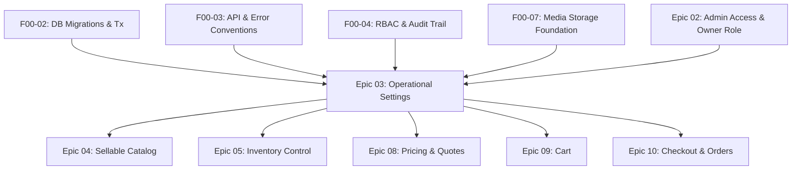

# Dependencies, Migrations & Compatibility — Epic 03

## 1. Upstream & Cross-Epic Dependencies

Epic 03 sits at the root of operational domain capabilities. Its dependencies and downstream consumers are structured as follows:



### 1.1 Strict Prerequisites
- **F00-02 (DB Migrations & Transaction Context):** Provides Drizzle ORM migration execution and the transactional unit of work helper (`tx.transaction()`).
- **F00-03 (API Conventions & Error Envelope):** Standardizes error responses (`{ error: { code, message, details, request_id } }`), minor-unit integer money representations, and ISO 8601 UTC timestamps.
- **F00-04 (Authorization Hooks & Audit Events):** Provides `requirePermission` / `requireRole` middleware and writes append-only rows to `audit_events`.
- **F00-07 (Media Storage Foundation):** Manages the upload, magic-byte sniffing, and storage of the store logo via `media` table records.
- **E02-01 & E02-02 (Admin Authentication & Permission Matrix):** Supplies the authenticated Store Owner session and enforces the `owner` role requirement for `/admin/settings/*`.

### 1.2 Downstream Enablers
- **Epic 04 (Catalog Management):** Consumes store currency and locale for formatting and pricing displays.
- **Epic 05 (Inventory Control):** Consumes `inventory_tracking_enabled` and `default_low_stock_threshold` from operational policies.
- **Epic 08 (Pricing & Quotes):** Consumes `tax_mode`, `tax_rate_basis_points`, `tax_shipping`, and `rounding_method` from `currentPolicy()` to compute order totals deterministically.
- **Epic 09 (Cart):** Consumes enabled shipping methods and currency symbols for cart totals estimation.
- **Epic 10 (Checkout & COD Submission):** Calls `isEligible(shippingAddress, methodId)` to enforce shipping eligibility and queries enabled payment methods (`cod`, `online_card`).

---

## 2. Database Migration Plan

Schema changes are implemented as a single, sequential Drizzle migration (`database/migrations/0008_operational_settings.sql` or next sequential number).

### 2.1 Principles
- **Additive Only (Expand-and-Contract):** Creates new tables, unique constraints, and foreign keys. Does not modify, rename, or drop preexisting tables.
- **Atomic Execution:** Migration runs inside an explicit `BEGIN ... COMMIT` block.
- **Idempotent Seeding:** A companion seed script inserts baseline operational rows only if the tables are empty.

### 2.2 Migration DDL Outline (`0008_operational_settings.sql`)

```sql
BEGIN;

-- 1. Store Settings Table
CREATE TABLE IF NOT EXISTS "store_settings" (
  "id" text PRIMARY KEY,
  "store_name" text NOT NULL,
  "legal_name" text,
  "support_email" text NOT NULL,
  "support_phone" text NOT NULL,
  "address" text NOT NULL,
  "logo_media_id" text REFERENCES "media"("id") ON DELETE SET NULL,
  "default_language" text NOT NULL DEFAULT 'ar-EG',
  "currency" text NOT NULL DEFAULT 'EGP',
  "currency_symbol" text NOT NULL DEFAULT 'ج.م',
  "currency_exponent" integer NOT NULL DEFAULT 2,
  "timezone" text NOT NULL DEFAULT 'Africa/Cairo',
  "date_format" text NOT NULL DEFAULT 'YYYY-MM-DD',
  "order_prefix" text NOT NULL DEFAULT 'ORD-',
  "updated_at" timestamptz NOT NULL DEFAULT now(),
  "updated_by" text NOT NULL
);

-- 2. Shipping Zones Table
CREATE TABLE IF NOT EXISTS "shipping_zones" (
  "id" text PRIMARY KEY,
  "name_ar" text NOT NULL,
  "name_en" text NOT NULL,
  "country_code" text NOT NULL DEFAULT 'EG',
  "governorates" jsonb NOT NULL,
  "is_active" boolean NOT NULL DEFAULT true,
  "created_at" timestamptz NOT NULL DEFAULT now(),
  "updated_at" timestamptz NOT NULL DEFAULT now()
);

-- 3. Shipping Methods Table
CREATE TABLE IF NOT EXISTS "shipping_methods" (
  "id" text PRIMARY KEY,
  "zone_id" text NOT NULL REFERENCES "shipping_zones"("id") ON DELETE CASCADE,
  "name_ar" text NOT NULL,
  "name_en" text NOT NULL,
  "cost_minor" integer NOT NULL DEFAULT 0,
  "estimated_days_min" integer NOT NULL DEFAULT 1,
  "estimated_days_max" integer NOT NULL DEFAULT 3,
  "is_active" boolean NOT NULL DEFAULT true,
  "created_at" timestamptz NOT NULL DEFAULT now(),
  "updated_at" timestamptz NOT NULL DEFAULT now(),
  CONSTRAINT "shipping_cost_non_negative" CHECK ("cost_minor" >= 0),
  CONSTRAINT "shipping_days_valid" CHECK ("estimated_days_min" <= "estimated_days_max")
);

-- 4. Payment Method Configs Table
CREATE TABLE IF NOT EXISTS "payment_method_configs" (
  "id" text PRIMARY KEY,
  "title_ar" text NOT NULL,
  "title_en" text NOT NULL,
  "instructions_ar" text,
  "instructions_en" text,
  "is_enabled" boolean NOT NULL DEFAULT true,
  "min_order_subtotal_minor" integer,
  "max_order_subtotal_minor" integer,
  "updated_at" timestamptz NOT NULL DEFAULT now(),
  "updated_by" text NOT NULL,
  CONSTRAINT "payment_method_valid_key" CHECK ("id" IN ('cod', 'online_card'))
);

-- 5. Operational Policy Versions Table
CREATE TABLE IF NOT EXISTS "operational_policy_versions" (
  "id" text PRIMARY KEY,
  "version" integer NOT NULL UNIQUE,
  "tax_mode" text NOT NULL DEFAULT 'exclusive',
  "tax_rate_basis_points" integer NOT NULL DEFAULT 1400,
  "tax_shipping" boolean NOT NULL DEFAULT false,
  "rounding_method" text NOT NULL DEFAULT 'half_up',
  "rounding_minor_unit" integer NOT NULL DEFAULT 100,
  "order_confirmation_mode" text NOT NULL DEFAULT 'manual',
  "inventory_tracking_enabled" boolean NOT NULL DEFAULT true,
  "default_low_stock_threshold" integer NOT NULL DEFAULT 5,
  "reservation_ttl_seconds" integer NOT NULL DEFAULT 900,
  "cod_confirmation_timeout_seconds" integer NOT NULL DEFAULT 86400,
  "change_reason" text,
  "effective_from" timestamptz NOT NULL DEFAULT now(),
  "created_by" text NOT NULL,
  CONSTRAINT "tax_mode_valid" CHECK ("tax_mode" IN ('exclusive', 'inclusive', 'disabled')),
  CONSTRAINT "tax_rate_non_negative" CHECK ("tax_rate_basis_points" >= 0),
  CONSTRAINT "confirmation_mode_valid" CHECK ("order_confirmation_mode" IN ('manual', 'auto_on_paid')),
  CONSTRAINT "reservation_ttl_positive" CHECK ("reservation_ttl_seconds" > 0)
);

CREATE INDEX IF NOT EXISTS "operational_policy_version_idx" ON "operational_policy_versions" ("version" DESC);

COMMIT;
```

---

## 3. Seed Baseline Data

To guarantee operational readiness upon migration completion, a seed transaction executes the following default state:

1. **Default Store Settings:**
   - `id`: `'default'`
   - `store_name`: `'متجر بيميد'`
   - `support_email`: `'support@bmadecomm.eg'`
   - `support_phone`: `'+201012345678'`
   - `address`: `'القاهرة، جمهورية مصر العربية'`
   - `currency`: `'EGP'`, `currency_symbol`: `'ج.م'`, `currency_exponent`: `2`
   - `timezone`: `'Africa/Cairo'`, `default_language`: `'ar-EG'`, `order_prefix`: `'ORD-'`
   - `updated_by`: `'system_bootstrap'`

2. **Default Shipping Zones & Methods (Egypt Baseline):**
   - **Zone 1: Greater Cairo (`zone_cairo_giza`):**
     - Governorates: `['cairo', 'giza']`
     - Standard Delivery: `50.00 EGP` (5000 minor units), 1–2 days transit.
     - Express Delivery: `85.00 EGP` (8500 minor units), 1 day transit.
   - **Zone 2: Alexandria & Delta (`zone_alex_delta`):**
     - Governorates: `['alexandria', 'beheira', 'dakahlia', 'gharbia', 'kafr_el_sheikh', 'monufia', 'qalyubia', 'sharqia', 'damietta']`
     - Standard Delivery: `65.00 EGP` (6500 minor units), 2–4 days transit.
   - **Zone 3: Canal & Upper Egypt (`zone_canal_upper`):**
     - Governorates: `['ismailia', 'port_said', 'suez', 'faiyum', 'beni_suef', 'minya', 'asyut', 'sohag', 'qena', 'luxor', 'aswan', 'red_sea', 'new_valley', 'matrouh', 'north_sinai', 'south_sinai']`
     - Standard Delivery: `85.00 EGP` (8500 minor units), 3–6 days transit.

3. **Default Payment Method Configs:**
   - `'cod'`: Enabled, Arabic title: `'الدفع عند الاستلام'`, instructions: `'الدفع نقدًا عند استلام الشحنة من مندوب التوصيل.'`
   - `'online_card'`: Enabled, Arabic title: `'الدفع الإلكتروني عبر البطاقة'`, instructions: `'الدفع الآمن عبر بطاقات فيزا، ماستركارد، وميزة.'`

4. **Default Initial Policy Version (`version = 1`):**
   - `tax_mode`: `'exclusive'`, `tax_rate_basis_points`: `1400` (14.00% Egyptian VAT), `tax_shipping`: `false`
   - `rounding_method`: `'half_up'`, `rounding_minor_unit`: `100`
   - `order_confirmation_mode`: `'manual'`, `inventory_tracking_enabled`: `true`
   - `default_low_stock_threshold`: `5`, `reservation_ttl_seconds`: `900` (15 mins), `cod_confirmation_timeout_seconds`: `86400` (24 hrs)
   - `change_reason`: `'System initialization baseline'`

---

## 4. Backward Compatibility & Forward Extensibility

1. **Multi-Currency Extensibility (P2 Ready):**
   - Rather than hardcoding formatting rules into UI components, all financial calculations and formatting hooks pull `currency`, `currency_symbol`, and `currency_exponent` dynamically from `store_settings`. When multi-currency is introduced in P2, the schema expands without disrupting database contracts.
2. **Multi-Country Shipping (P2 Ready):**
   - `shipping_zones` explicitly holds `country_code` (`EG`). International shipping expansion will simply introduce zones with different country codes without schema alteration.
3. **Immutability Protection:**
   - Because all financial policies are versioned with immutable records, historical orders and audit reporting will never drift, regardless of how many future policy updates are deployed.

